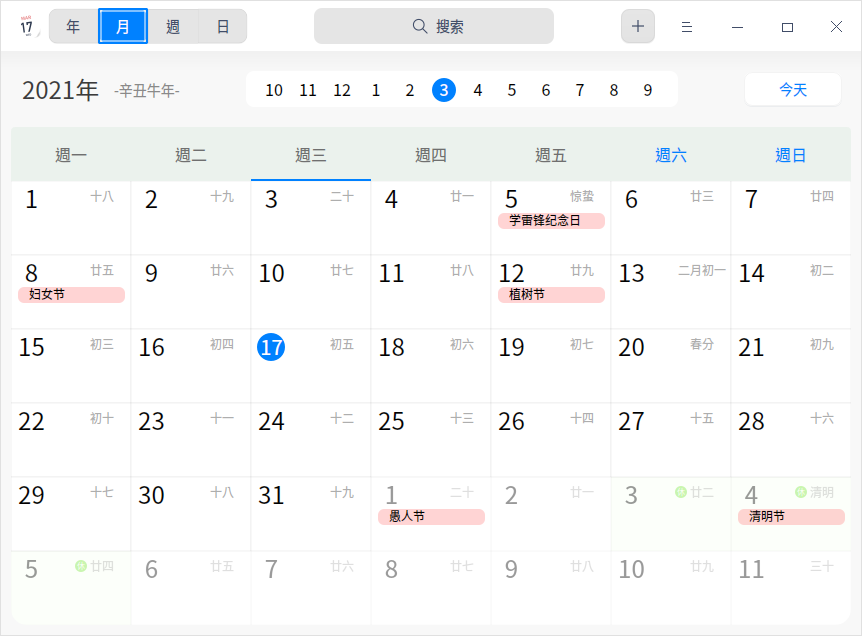
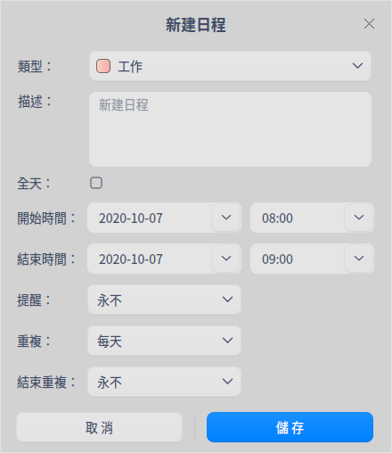

# 日曆|dde-calendar|

## 概述

日曆是一款查看日期、管理日程的小工具，支持查看農曆、黃曆、節氣和常見的節日訊息等，內置日程提醒功能幫您更好地規劃時間。

## 使用入門

通過以下方式運行或關閉日曆，或者創建日曆的快捷方式。

### 運行日曆

1. 單擊任務欄上的啟動器圖標 ，進入啟動器界面。
2. 上下滾動鼠標滾輪瀏覽或通過搜索，找到日曆圖標 ，單擊運行。
3. 右鍵單擊 ，您可以：

   - 單擊 **傳送到桌面**，在桌面創建快捷方式。
   - 單擊 **傳送到任務欄**，將應用程序固定到任務欄。
   - 單擊 **加至開機啟動**，將應用程序添加到開機啟動項，在電腦開機時自動運行該應用。

### 關閉日曆

- 在日曆界面單擊 ，關閉日曆。
- 在任務欄右鍵單擊 ，選擇 **關閉所有**，關閉日曆。
- 在日曆界面單擊 ，選擇 **退出**，關閉日曆。

### 查看快捷鍵

在日曆界面，使用快捷鍵 **Ctrl + Shift + ?** 打開快捷鍵預覽界面。熟練地使用快捷鍵，將大大提升您的操作效率。

## 操作介紹

日曆分為年、月、周、日視圖，通過不同的視圖方式展示日期屬性。

系統默認顯示月視圖，可以通過鼠標單擊切換年、月、周、日視圖。

- 僅在中文系統中，日曆會顯示日期所對應的農曆日期、黃曆和節日訊息。
- 日期以 **1900** 年為起點，在日期切換時，不能查看早於 **1900** 年的日期。
- 在月視圖、周視圖中，週六、週日的日期顯示會區別於週一至週五。

> 說明：系統默認一週首日為星期一，您可以在 **控制中心 > 日期與時刻 > 格式設置** 中修改一週顯示順序。

| 視圖 | 說明                                |
| ---- | ------------------------------------ |
| 年   | 顯示全年的月份、天數。               |
| 月   | 顯示節日訊息、日程安排。             |
| 周   | 顯示這一週每天的日程安排。           |
| 日   | 顯示節日訊息、詳細的日程安排和黃曆。 |

### 新建日程

1. 在月、周或者日視圖中，選中一個日期。
2. 雙擊日期空白處或者單擊右鍵選擇 **新建日程**，彈出 **新建日程** 窗口。
3. 設置日程類型、內容、時間、提醒等訊息。

> 竅門：您也可以單擊菜單欄上的按鈕  新建日程。

   - 類型：工作、生活和其他。
   - 日程的時間：全天、開始時間和結束時間。
      - 當勾選全天時：
         + 開始時間、結束時間：不能設置小時和分鐘，只能選擇日期。
         + 提醒設置：從不、日程發生當天（上午9時）、1天前、 2天前和1週前，其中1天前為默認設置。
      
      - 當不勾選全天時：
         + 開始時間、結束時間：既能設置小時和分鐘，也能選擇日期。
         + 提醒設置：從不、日程開始時、15分鐘前、30分鐘前、1小時前、1天前、 2天前、1週前。

   - 重複：從不、每天、工作日、每週、每月和每年。
   - 結束重複：從不、於n次後、於日期。

   >說明：只有設置了 **重複** 功能，**結束重複** 才會出現。

4. 單擊 **儲存**，創建日程。

> 說明：支持將日程標籤拖拽到指定的日期或時間上。

### 更改日程

1. 在月、周或者日視圖中，雙擊或右鍵單擊日程標籤。
2. 選擇 **更改**，彈出 **更改日程** 窗口。
3. 設置日程的相關屬性。 
4. 單擊 **儲存**。 
5. 如果有設置全天或者重複，則彈出提示框，確認提示訊息，完成日程更改。

更改日程時，系統會根據所更改內容顯示不同的提示訊息。提示訊息中按鈕說明如下表。

| 按鈕         | 說明                                                         |
| ------------ | ------------------------------------------------------------ |
| 全部日程     | 更改所有與此相關的重複日程。                                 |
| 僅此日程     | 只更改當前日程。                                             |
| 所有將來日程 | 更改當前選中日期及以後日期的日程，選中的日期之前的日程仍然保留。 |
| 全部更改     | 更改所有重複日程。                                           |

### 設置全天或多天日程

在創建日程或更改日程時，設置 **開始時間**、**結束時間**，可以設置全天或多天持續的日程。

### 設置重複日程

1. 在創建日程或更改日程時，單擊 **重複** 右側的下拉列表，選擇 **每天**、**工作日**、**每週**、**每月** 或 **每年** 重複日程。
2. 單擊 **結束重複** 右側的下拉列表，設置日程的停止時間。

### 搜索日程

1. 在日曆界面頂部搜索框中，單擊 ，輸入關鍵字。
2. 按下鍵盤上的 **Enter** 鍵進行搜索。
3. 在搜索框中單擊或刪除輸入的訊息，清除當前輸入的關鍵字或取消搜索。

### 查看日程

在月、周、日視圖下，雙擊日程標籤，彈出「我的日程」窗口，此時即可以查看日程，也可以 [更改日程](#更改日程) 或 [刪除日程](#刪除日程)。

### 查看日程提醒詳情

當系統發出通知後，單擊通知提示框，查看日程詳情。

日程提醒時，提示訊息按鈕說明如下表。

| 按鈕        | 說明                                                         |
| ----------- | ------------------------------------------------------------ |
| 稍後提醒    | 提醒設置為當天，首次提醒後，單擊「稍後提醒」，10分鐘後再次提醒，此後每次單擊「稍後提醒」增加5分鐘的時間間隔。 |
| 明天提醒    | 提醒設置為1天前或2天前時，出現該按鈕。                       |
| 提前1天提醒 | 提醒設置為1週前時，出現該按鈕。                              |
| 關閉        | 關閉提示訊息。                                               |

### 刪除日程

1. 在月、周或者日視圖中，雙擊或右鍵單擊日程標籤。
2. 選擇 **刪除**，彈出 「您正在刪除日程」提示框。
3. 確認提示訊息，刪除日程。

您也可以 單擊 **取消**，停止刪除日程。

刪除日程時，重複與非重複日程提示訊息中按鈕說明如下表。

| 按鈕             | 說明                                                         |
| ---------------- | ------------------------------------------------------------ |
| 刪除日程         | 刪除非重複日程。                                             |
| 全部刪除         | 刪除所有的重複日程。                                         |
| 僅刪除該日程     | 針對重複日程，僅刪除當前所選日程。                           |
| 刪除所有將來日程 | 針對重複日程，刪除當前選中日期及以後日期的日程，選中的日期之前的日程仍然保留。 |

## 主菜單

在主菜單中，您可以切換窗口主題、查看幫助手冊，了解日曆的更多訊息。

### 主題

窗口主題包含淺色主題、深色主題和系統主題。

1. 在日曆界面，單擊。
2. 選擇 **主題**，選擇一個主題顏色。

### 幫助

查看幫助手冊，進一步了解和使用日曆。

1. 在日曆界面，單擊 。
2. 選擇 **幫助**。
3. 查看日曆的幫助手冊。

### 關於

1. 在日曆界面，單擊 。
2. 選擇 **關於**。
3. 查看日曆的版本和介紹。

### 退出

1. 在日曆界面，單擊 。
2. 選擇 **退出**。
