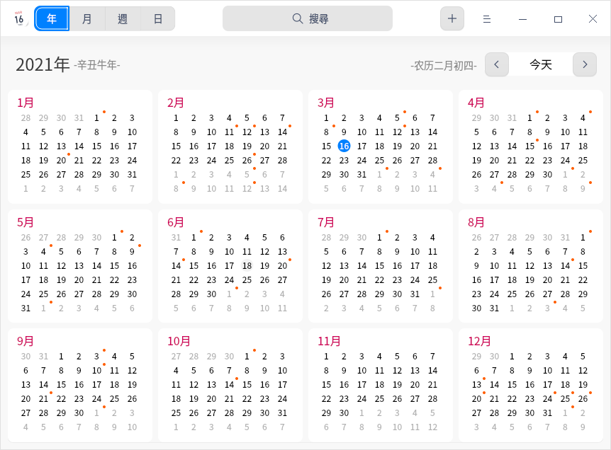

# 日曆|dde-calendar|

## 概述

日曆是一款查看日期、管理日程的小工具，支援查看農曆、黃曆、節氣和常見的節日訊息等，內建日程提醒功能幫您更好地規劃時間。

## 使用入門

透過以下方式執行或關閉日曆，或者建立日曆的捷徑。

### 執行日曆

1. 單擊任務欄上的啟動器圖示  ，進入啟動器介面。
2. 上下滾動滑鼠滾輪瀏覽或透過搜尋，找到日曆圖示  ，單擊執行。
3. 右鍵單擊 ，您可以：

   - 單擊 **建立桌面捷徑**，在桌面建立捷徑。
   - 單擊 **釘選到Dock**，將應用程式固定到Dock。
   - 單擊 **開機啟動**，將應用程式添加到開機啟動項，在電腦開機時自動執行該應用。

### 關閉日曆

- 在日曆介面單擊 ，關閉日曆。
- 在任務欄右鍵單擊 ，選擇 **全部關閉**，關閉日曆。
- 在日曆介面單擊 ，選擇 **離開**，關閉日曆。

### 查看快捷鍵

在日曆介面上，使用快捷鍵 **Ctrl + Shift + ?** 打開快捷鍵預覽介面。熟練地使用快捷鍵，將大大提升您的操作效率。

## 操作介紹

日曆分為年、月、周、日檢視，透過不同的檢視方式展示日期屬性。

系統預設顯示月檢視，可以透過滑鼠單擊切換年、月、周、日檢視。

- 僅在中文系統中，日曆會顯示日期所對應的農曆日期、黃曆和節日訊息。
- 日期以 **1900** 年為起點，在日期切換時，不能查看早於 **1900** 年的日期。
- 在月檢視、周檢視中，週六、週日的日期顯示會區別於週一至週五。

>  說明： 系統預設一週起始日為星期一，您可以在**控制中心** > **時間日期** > **格式設定** 中修改一週顯示順序。

| 檢視 | 亮點                                 |
| ---- | ------------------------------------ |
| 年   | 顯示全年的月份、天數。               |
| 月   | 顯示節日訊息、日程安排。             |
| 周   | 顯示這一週每天的日程安排。           |
| 日   | 顯示節日訊息、詳細的日程安排和黃曆。 |

### 建立日程

1. 在月、周或者日檢視中，選中一個日期。
2. 雙擊日期空白處或者單擊滑鼠右鍵 **建立日程**，彈出 **建立日程** 視窗。
3. 設定日程類型、內容、時間、提醒等訊息。

> 竅門：你也可以單擊選單欄上的  按鈕建立日程。

   
   &nbsp;&nbsp;&nbsp;&nbsp;&nbsp;&nbsp;&nbsp;&nbsp;&nbsp;&nbsp;&nbsp;&nbsp;&nbsp;

   - 類型：工作、生活和其他。
   - 日程的時間：全天、開始時間和結束時間。

      - 當勾選全天時：
         - 開始時間、結束時間：不能設定小時和分鐘，只能選擇日期。
         - 提醒設定：從不、日程發生當天（上午9時）、1天前、 2天前和1週前，其中1天前為預設設定。

      - 當不勾選全天時：
         - 開始時間、結束時間：既能設定小時和分鐘，也能選擇日期。
         - 提醒設定：從不、日程開始時、15分鐘前、30分鐘前、1小時前、1天前、2天前、1週前。

   - 重複：從不、每天、工作日、每週、每月和每年。
   - 結束重複：從不、於n次後、於日期。

   >  說明：只有設定了 **重複** 功能，**結束重複** 才會出現。

4. 單擊 **儲存**，建立日程。

   >  說明：支援將日程標籤拖曳到指定的日期或時間上。

### 編輯日程

1. 在月、周或者日檢視中，雙擊或右鍵單擊日程標籤。
2. 選擇 **編輯**，彈出 **編輯日程** 視窗。
3. 設定編輯日程的相關屬性。 
4. 單擊 **儲存**。 
5. 如果有設定全天或者重複，則彈出提示框，確認提示訊息，完成日程編輯。

編輯日程時，系統會根據所更改內容，顯示不同的提示訊息。提示訊息中按鈕說明如下表。

| 按鈕         | 說明                                                         |
| ------------ | ------------------------------------------------------------ |
| 全部日程     | 修改所有與此相關的重複日程。                                 |
| 僅此日程     | 只修改目前日程。                                             |
| 所有將來日程 | 修改目前選中日期及以後日期的日程，選中日期前的日程仍然保留。 |
| 全部更改     | 修改所有的重複日程。                                         |

### 設定全天或多天日程

在建立日程或編輯日程時，設定 **開始時間**、**結束時間**，可以設定全天或多天持續的日程。

### 設定重複日程

1. 在建立日程或編輯日程時，單擊 **重複** 右側的下拉選單，選擇 **每天**、**工作日**、**每週**、**每月** 或 **每年** 重複日程。  
2. 單擊 **結束重複** 右側的下拉選單，然後選取日程的停止時間。

### 搜尋日程

1. 在日曆介面頂部搜尋框中，單擊  ，輸入關鍵字。
2. 按下鍵盤上的 **Enter** 鍵進行搜尋。 
3. 在搜尋框中單擊  或刪除輸入的訊息，即可清除目前輸入的關鍵字或取消搜尋。

### 查看日程

在月、周、日檢視下，雙擊日程標題，彈出「我的日程」視窗，此時即可以查看日程也可以 [編輯日程](#編輯日程) 或 [刪除日程](#刪除日程)。

### 查看日程提醒詳情

當系統發出通知後，可以單擊通知提示框，查看日程提醒詳情。

日程提醒時，提示訊息按鈕說明如下表。

| 按鈕        | 說明                                                         |
| ----------- | ------------------------------------------------------------ |
| 稍後提醒    | 提醒設定為當天，首次提醒後，點擊「稍後提醒」，10分鐘後再次提醒，此後每次點擊「稍後提醒」增加5分鐘。 |
| 明天提醒    | 提醒設定為1天前或2天前時，出現該按鈕。                       |
| 提前1天提醒 | 提醒設定為1週前時，出現該按鈕。                              |
| 關閉        | 關閉提示訊息。                                               |

### 刪除日程

1. 在月、周或者日檢視中，雙擊或右鍵單擊日程標籤。
2. 選擇 **刪除**，彈出 **您正在刪除日程** 提示框。
3. 確認提示訊息，刪除日程。

您也可以 單擊 **取消**，停止刪除日程。

刪除日程時，重複與非重複日程提示訊息中按鈕說明如下表。

| 按鈕             | 說明                                                         |
| ---------------- | ------------------------------------------------------------ |
| 刪除日程         | 刪除非重複日程。                                             |
| 全部刪除         | 刪除所有的重複日程。                                         |
| 僅刪除此日程     | 針對重複日程，僅刪除目前所選日程。                           |
| 刪除所有將來日程 | 針對重複日程，刪除目前選中日期及以後日期的日程，選中日期前的日程仍然保留。 |

## 主選單

在主選單中，您可以切換视窗主題、查看說明手冊，了解日曆的更多訊息。

### 主題

视窗主題包含亮色主題、暗色主題和系統主題。

1. 在日曆界面，單擊 。
2. 單擊 **主題**，選擇一個主題顏色。

### 說明

查看說明手冊，進一步了解和使用日曆。

1. 在日曆界面，單擊  。
2. 單擊 **說明**。
3. 查看日曆的說明手冊。

### 關於

1. 在日曆界面，單擊  。
2. 單擊 **關於**。
3. 查看日曆的版本和介紹。

### 離開

1. 在日曆界面，單擊  。
2. 單擊 **離開**。

